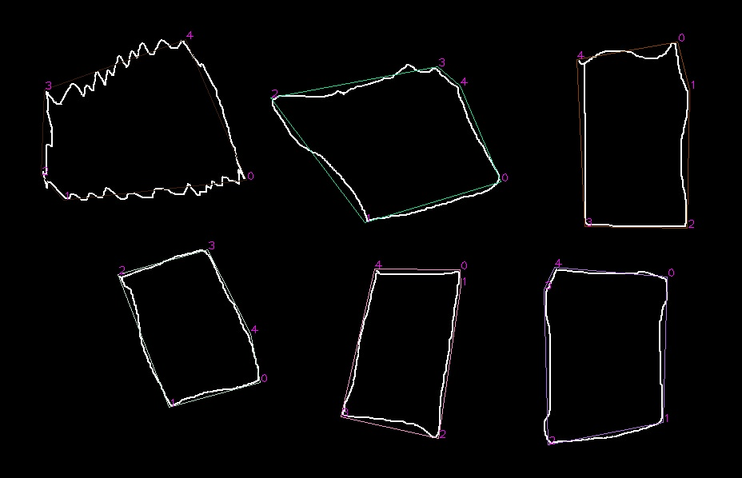
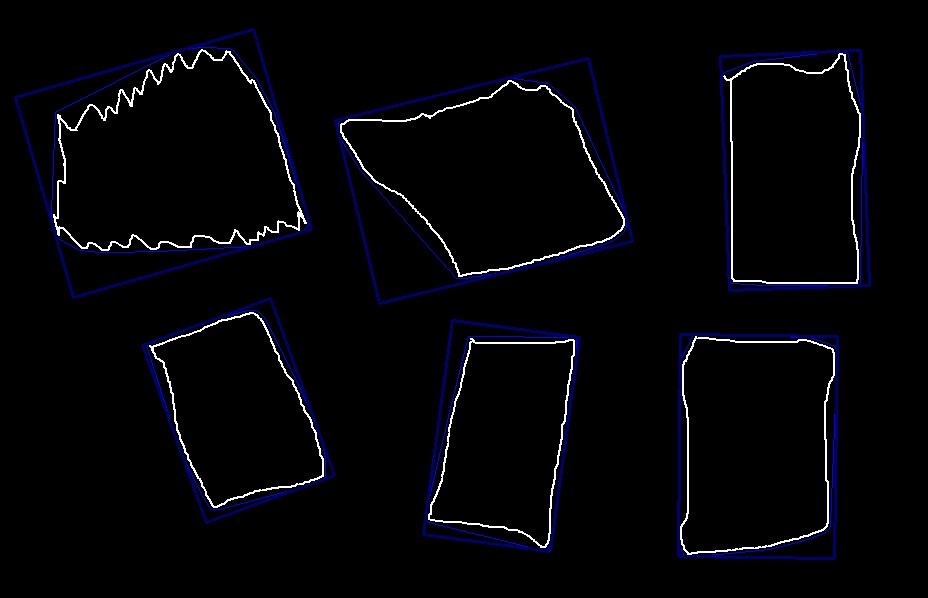

本工程功能如下：
1 尝试使用凸多边形逼近已知封闭曲线；
2 尝试使用指定了固定边长数目的凸多边形逼近已知封闭曲线（某种意义上已经完成）
3 尝试识别出已知的某封闭曲线是几边形（利用功能2实现）
4 尝试某封闭曲线的最小外接旋转矩形
 主要结论如下：
1 功能1已经由opencv提供的api实现；本工程在此基础上进行了优化，主要是考虑边长们的方差最小化和新曲线覆盖面积的误差率最小化， 这个实现的还可以
2 功能2，并非所有的形状都可以调用opencv的接口函数approxPolyDP得到指定边数的凸多边形。但是对于形状比较契合指定的边数的情形，是可以得到逼近的。否则，通常做不到。利用旋转矩形做最小覆盖的做法不是本工程的目的，也无助于实现这里的目的。
3 暂无结论

 

